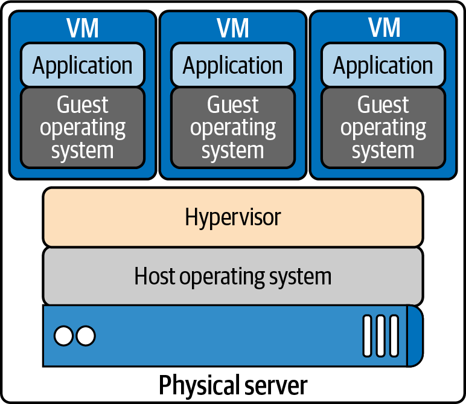
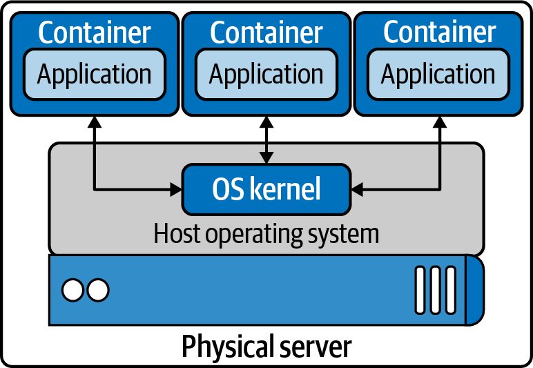

## Hypervisor
-   A hypervisor emulates hardware resources, CPU, and memory from a host
    machine to create guest operating systems or virtual machines.
- separate networking stack
- removing the port conflict issues on shared systems.
- 
## Containers
- each container has its own network stack
- container allows developers to package and deploy applications
- containers use host OS
- 
### Some Containers Object are:
- Container, image, container engine, container runtime, base image, image layer, image format, registry... e.t.c
## Container Runtime:
### low Level Container Runtimes
- LXC
### HIgh Level Container Runtimes


### add Network Namespace
$ sudo ip netns add net1
### add Virtual-ethanet
$ sudo ip link add veth0 type veth peer name veth1
### add veth1 into the new network namespace net1
$ sudo ip link set veth1 netns net1

$ sudo ip link add veth0 type veth peer name veth1

### IP addressing in order to carry packets from the net1 namespace to the root namespace
$ sudo ip netns exec net1 ip addr add 192.168.1.101/24 dev veth1
### As with host networking interfaces, they will need to be “turned on”
$ sudo ip netns exec net1 ip link set dev veth1 up
### Let’s turn up the veth0 side of the pair now:
$ sudo ip link set dev veth0 up

$ sudo ip link add br0 type bridge
$ sudo ip link set dev br0 up
$ sudo ip link set <hostOsInterface> master br0
$ sudo ip link set veth0 master br0
$ sudo ip netns exec net1 ip route add default via 192.168.1.100

$ sudo ip netns exec net1 ip r
default via 192.168.1.100 dev veth1
192.168.1.0/24 dev veth1 proto kernel scope link src 192.168.1.100


# Two different Network  namespaces and Bridge :

### some ip cmd:
```
$ ip a
$ ip route
```
### Create two isolate network namespaces
```
$ ip netns add ns1
$ ip netns add ns2
```
### add OpenVswitch
```
$ ovs-vsctl add-br ovs1
$ ovs-vsctl show 

```

### add v-eth ns1
```
$ ip link add eth0-1 type veth peer name veth-1
```
### add one side to ns1 namespace and another to Vswitch
```
$ ip link set eth0-r netns red
$ ip netns exec red ip link
$ ovs-vsctl add-port ovs1 veth-r
$ ovs-vsctl show
```

### add v-eth ns2
```
$ ip link add eth0-2 type veth peer name veth-2
```
### add one side to red namespace and another to Vswitch
```
$ ip link set eth0-1 netns ns1
$ ip netns exec ns1 ip link
$ ovs-vsctl add-port ovs1 veth-1
$ ovs-vsctl show
```


### ns1 namespace: up all interface and add ip address
```
$ ip link set veth-1 up
$ ip netns exec ns1 ip link set dev lo up
$ ip netns exec ns1 ip link set dev eth0-1 up
$ ip netns exec ns1 ip address add 10.0.0.1/24 dev eth0-1
$ ip netns exec ns1 ip a
$ ip netns exec ns1 ip route
```

### ns2 namespace: up all interface and add ip address

```
$ ip link set veth-2 up
$ ip netns exec ns2 ip link set dev lo up
$ ip netns exec ns2 ip link set dev eth0-2 up
$ ip netns exec ns2 ip address add 10.0.0.1/24 dev eth0-2
$ ip netns exec ns2 ip a
$ ip netns exec ns2 ip route
```
### Test a Ping Request
```
$ ip link exec ns1 bash
-ping -c 5 10.0.0.2

```


